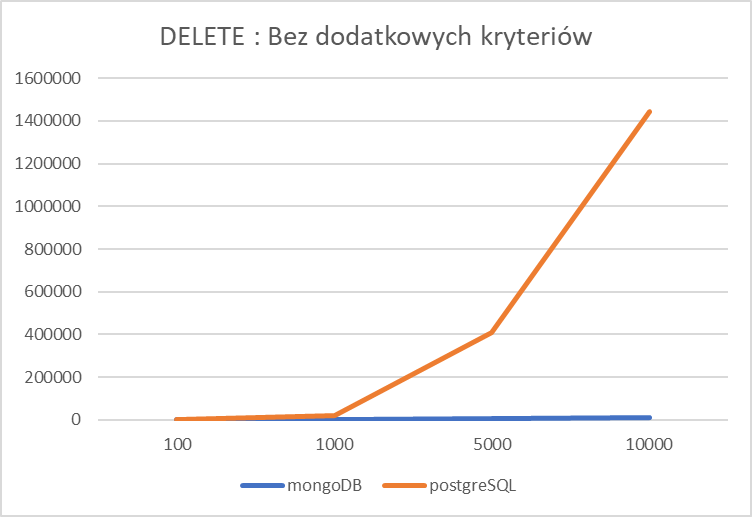

Sprawozdanie

**Projekt   
Zaawansowane Technologie Baz Danych**

Analiza wydajności systemów baz danych (PostgreSQL oraz MongoDB) na przykładzie ofert mieszkań i domów w Hiszpanii

>   Kamil Kubala, Maciej Spólnik

>   Informatyka, Cyberbezpieczeństwo

>   Studia II stopnia, tryb niestacjonarny

Rok akademicki 2022/2023

Spis treści

[1 Opis techniczny i teoretyczny](#opis-techniczny-i-teoretyczny)

[1.1 Wstęp](#wstęp)

[1.2 Relacyjne bazy daych](#relacyjne-bazy-daych)

[1.3 PostgreSQL](#postgresql)

[1.4 Nierelacyjne bazy daych](#nierelacyjne-bazy-daych)

[1.5 Mongo](#mongo)

[2 Opis Aplikacji](#opis-aplikacji)

[2.1 Wykorzystane narzędzia](#wykorzystane-narzędzia)

[2.1.1 Postman](#postman)

[2.1.2 Figma](#figma)

[2.1.3 IntelliJ IDEA](#intellij-idea)

[2.1.4 Git](#git)

[2.1.5 Java SpringBoot](#java-springboot)

[2.1.6 Python](#python)

[2.1.7 React](#react)

[3 Implementacja](#implementacja)

[3.1 Architektura systemu](#_Toc126844082)

[3.2 Python](#python-1)

[3.3 Java Spring Boot](#java-spring-boot)

[3.4 React](#react-1)

[3.5 Relacyjna baza danych](#relacyjna-baza-danych)

[3.6 Nierelacyjna baza danych](#nierelacyjna-baza-danych)

[4 Porównania wydajnościowe dla operacji CRUD](#porównania-wydajnościowe-dla-operacji-crud)

[4.1 GET](#get)

[4.2 POST](#post)

[4.3 PUT](#put)

[4.4 DELETE](#delete)

[5 Wnioski po analizie wyników porównań wydajnościowych](#wnioski-po-analizie-wyników-porównań-wydajnościowych)

# Opis techniczny i teoretyczny

## Wstęp

Celem niniejszej pracy jest przeprowadzenie porównania relacyjnej bazy danych PostgrSQL oraz nierelacyjnej bazy danych MongoDB. Porównanie zostanie przeprowadzone na podstawie ofert mieszkań i domów w Hiszpani, poprzez przygotowanie odpowiednich baz danych, zaimplementowanie metod porównawczych oraz przygotowanie interfejsu graficznego.

## Relacyjne bazy daych

Relacyjne bazy danych (ang. relational databases) to jedne z najbardziej powszechnie używanych i najbardziej rozpowszechnionych typów baz danych. Dane są przechowywane w tabelach, które są połączone ze sobą poprzez odpowiednie relacje.

Relacyjne bazy danych są szeroko stosowane w wielu aplikacjach, w tym w aplikacjach internetowych, komputerowych i mobilnych, a także w aplikacjach biznesowych i naukowych. Są faworyzowani ze względu na zdolność do obsługi dużych ilości ustrukturyzowanych danych, obsługę wielu użytkowników oraz zdolność do zachowania integralności danych dzięki zastosowaniu ograniczeń.

Jedną z kluczowych cech relacyjnych baz danych jest ich zdolność do obsługi złożonych relacji między danymi. Na przykład relacyjnej bazy danych można używać do przechowywania informacji o klientach, zamówieniach i produktach. Każdy z nich byłby przechowywany w osobnej tabeli, a relacje między nimi byłyby ustalane za pomocą kluczy. Pozwala to na sprawne przeszukiwanie danych, a także możliwość łatwej aktualizacji lub modyfikacji danych bez wpływu na relacje między tabelami.

Inną ważną cechą relacyjnych baz danych jest ich zdolność do wymuszania ograniczeń. Ograniczenia to reguły rządzące danymi przechowywanymi w bazie danych, zapewniające ich spójność i dokładność. Na przykład można zastosować ograniczenie, aby uniemożliwić złożenie zamówienia na produkt, którego nie ma w magazynie.

Dostęp do relacyjnych baz danych można uzyskać za pomocą Structured Query Language (SQL), który jest ustandaryzowanym językiem do zarządzania relacyjnymi bazami danych i manipulowania nimi. SQL udostępnia szereg poleceń do tworzenia i modyfikowania tabel, wstawiania i pobierania danych oraz wymuszania ograniczeń. Pozwala także na tworzenie złożonych zapytań, które mogą służyć do wydobywania informacji z bazy danych na podstawie określonych kryteriów.

Pomimo wielu zalet relacyjnych baz danych, istnieją również pewne wyzwania związane z ich użytkowaniem. Jednym z największych wyzwań jest wydajność, ponieważ relacyjne bazy danych mogą stać się powolne i nieporęczne podczas obsługi dużych ilości danych. Kolejnym wyzwaniem jest skalowalność, ponieważ relacyjne bazy danych mogą być trudne do skalowania w celu sprostania rosnącym wymaganiom.

Podsumowując, relacyjne bazy danych są potężnym narzędziem do organizowania danych strukturalnych i zarządzania nimi. Oferują szereg funkcji, które ułatwiają obsługę złożonych relacji między danymi, wymuszanie ograniczeń i wydobywanie informacji z bazy danych. Chociaż ich użycie wiąże się z wyzwaniami, pozostają one popularnym wyborem w wielu zastosowaniach ze względu na ich wszechstronność i niezawodność.

## PostgreSQL

PostgreSQL, powszechnie określany jako Postgres, to potężny system zarządzania obiektowo-relacyjnymi bazami danych typu open source. Jest znany ze swojego solidnego zestawu funkcji, niezawodności i skalowalności. Postgres został zaprojektowany do obsługi złożonych danych o dużej objętości i jest szeroko stosowany w różnych aplikacjach, od aplikacji internetowych po badania naukowe.

System zarządzania bazami danych jest wysoce skalowalny, co oznacza, że może obsłużyć dużą ilość danych i dużą liczbę użytkowników. Obsługuje szereg zaawansowanych funkcji, takich jak skalowanie w poziomie i automatyczne przełączanie awaryjne, dzięki czemu doskonale nadaje się do zastosowań o wysokiej dostępności i wydajności.

Postgres zapewnia również niezawodne funkcje bezpieczeństwa, w tym kontrolę dostępu opartą na rolach, szyfrowanie w stanie spoczynku i silne uwierzytelnianie. Dzięki temu nadaje się do zastosowań wymagających ochrony wrażliwych danych. Posiada również bogaty zestaw typów danych, w tym tradycyjne typy danych, takie jak liczby całkowite, ciągi znaków i daty, a także bardziej wyspecjalizowane typy danych, takie jak tablice, dane geometryczne i dane wyszukiwania tekstowego.

Jedną z kluczowych zalet Postgres jest możliwość obsługi złożonych operacji na danych, takich jak łączenia i agregacje. Udostępnia szereg zaawansowanych funkcji, takich jak zmaterializowane widoki, które mogą znacząco poprawić wydajność tego typu operacji. Zapewnia również szereg zaawansowanych funkcji zapewniających integralność danych, takich jak transakcje i ograniczenia, które pomagają zapewnić spójność i dokładność danych w bazie danych.

## Nierelacyjne bazy daych

Nierelacyjne bazy danych, znane również jako bazy danych NoSQL, to rodzaj systemu zarządzania bazami danych, który przechowuje dane w formacie innym niż tradycyjny model relacyjny. W przeciwieństwie do relacyjnych baz danych, które przechowują dane w tabelach z wierszami i kolumnami, nierelacyjne bazy danych przechowują dane w różnych formatach, w tym w parach klucz-wartość, dokumentach i wykresach.

Jedną z kluczowych zalet nierelacyjnych baz danych jest ich zdolność do obsługi dużych ilości danych nieustrukturyzowanych i częściowo ustrukturyzowanych. Kontrastuje to z relacyjnymi bazami danych, które najlepiej nadają się do danych strukturalnych. Nierelacyjne bazy danych są również wysoce skalowalne, co czyni je dobrym wyborem dla aplikacji internetowych i mobilnych, które szybko się rozwijają.

Kolejną zaletą nierelacyjnych baz danych jest ich elastyczność. Ponieważ nie opierają się na stałym schemacie, nierelacyjne bazy danych mogą łatwo dostosowywać zmiany w strukturze przechowywanych danych. Dzięki temu doskonale nadają się do zastosowań, w których model danych stale ewoluuje.

Jednym z najpopularniejszych typów nierelacyjnych baz danych jest baza danych zorientowana na dokumenty, która przechowuje dane jako dokumenty w formacie takim jak JSON lub XML. Pozwala to na łatwe przechowywanie i pobieranie złożonych struktur danych, takich jak dane zagnieżdżone. Przykładem bazy danych zorientowanej na dokumenty jest MongoDB.

Innym typem nierelacyjnej bazy danych jest magazyn klucz-wartość, który wykorzystuje prosty model danych, który odwzorowuje klucze na wartości. Magazyny klucz-wartość są zoptymalizowane pod kątem szybkich operacji odczytu i zapisu, dzięki czemu doskonale nadają się do aplikacji wymagających wysokiej wydajności. Przykładem magazynu klucz-wartość jest Redis.

Grafowe bazy danych to inny typ nierelacyjnych baz danych, które przechowują dane jako węzły i krawędzie w strukturze grafu. Graficzne bazy danych szczególnie dobrze nadają się do zastosowań, które wymagają złożonych relacji między danymi, takich jak sieci społecznościowe lub systemy rekomendacji. Przykładem bazy danych grafów jest Neo4j.

Nierelacyjne bazy danych nie używają języka SQL (Structured Query Language) do wykonywania zapytań i manipulowania danymi, tak jak w przypadku relacyjnych baz danych. Zamiast tego używają różnych interfejsów API i języków zapytań, które są specyficzne dla każdego typu bazy danych.

Pomimo zalet nierelacyjnych baz danych, istnieją również pewne wyzwania związane z ich użytkowaniem. Jednym z największych wyzwań jest brak standaryzacji, ponieważ różne nierelacyjne bazy danych mają różne modele danych i języki zapytań. Kolejnym wyzwaniem jest trudność w wykonywaniu złożonych operacji na danych, takich jak agregacje i łączenia, które są łatwe do wykonania w relacyjnych bazach danych.

Podsumowując, nierelacyjne bazy danych oferują szereg korzyści w porównaniu z tradycyjnymi relacyjnymi bazami danych, w tym możliwość obsługi dużych ilości danych nieustrukturyzowanych i częściowo ustrukturyzowanych, skalowalność i elastyczność. Chociaż istnieją wyzwania związane z ich używaniem, nierelacyjne bazy danych stają się coraz bardziej popularne w szerokim zakresie zastosowań, ze względu na ich zdolność do obsługi unikalnych wymagań nowoczesnych danych.

## Mongo

MongoDB to szeroko stosowany, oparty na dokumentach system zarządzania bazą danych o otwartym kodzie źródłowym. Jest klasyfikowana jako baza danych NoSQL, co oznacza, że przechowuje dane w formacie nierelacyjnym, w przeciwieństwie do tradycyjnych relacyjnych baz danych, które przechowują dane w tabelach z wierszami i kolumnami.

Jedną z kluczowych zalet MongoDB jest elastyczny model danych. W przeciwieństwie do relacyjnych baz danych, które wymagają stałego schematu, MongoDB umożliwia przechowywanie danych w różnych formatach, w tym w zagnieżdżonych strukturach danych. To sprawia, że doskonale nadaje się do aplikacji, które wymagają możliwości obsługi złożonych struktur danych.

MongoDB wykorzystuje model danych oparty na dokumentach, co oznacza, że dane są przechowywane jako dokumenty w formacie takim jak JSON lub BSON. Dokumenty te mogą zawierać dowolną liczbę pól i elementów zagnieżdżonych, co pozwala na łatwe przechowywanie i wyszukiwanie złożonych danych.

Kolejną zaletą MongoDB jest jego skalowalność. MongoDB wykorzystuje rozproszoną architekturę, która umożliwia skalowanie w poziomie na wielu serwerach. Dzięki temu doskonale nadaje się do aplikacji, które szybko się rozwijają i wymagają możliwości obsługi dużych ilości danych. Dodatkowo zapewnia potężny i łatwy w użyciu język zapytań, znany jako MongoDB Query Language (MQL), który pozwala na elastyczne i wydajne wyszukiwanie danych. Ponadto MongoDB zapewnia bogaty zestaw opcji indeksowania, w tym indeksy tekstowe i indeksy geoprzestrzenne, aby wspierać wydajne zapytania i wyszukiwanie danych.

MongoDB zapewnia również solidne funkcje bezpieczeństwa, w tym uwierzytelnianie użytkowników, kontrolę dostępu opartą na rolach oraz szyfrowanie w stanie spoczynku i podczas przesyłania. Dzięki temu doskonale nadaje się do zastosowań wymagających ochrony wrażliwych danych.

# Opis Aplikacji

## Wykorzystane narzędzia

### Postman

Do testowania zapytań API wykorzystany został Postman, który jest narzędziem do testowania API, które pozwala na wykonywanie i nagrywanie żądań HTTP, takich jak GET, POST, PUT i DELETE. Pozwala ono na łatwe tworzenie i przetestowanie żądań API, a także na wygodne przeglądanie odpowiedzi i sprawdzanie, czy spełniają one oczekiwania. Postman jest łatwy w użyciu i oferuje szereg funkcji, takich jak możliwość udostępniania i współdzielenia kolekcji żądań oraz wsparcie dla wielu formatów danych, takich jak JSON i XML. Został w nim utworzony workspace, po dodaniu nowego endpointa dodawane były kolejne przykładowe zapytania (rys. 1).


Rysunek 1. Workspace z dostępnymi zapytania API

### Figma

Przed rozpoczęciem prac został utworzony wstępny projekt aplikacji przy użyciu programu Figma, będąca narzędziem do projektowania i prototypowania interfejsów graficznych aplikacji mobilnych i webowych. Pozwala on na tworzenie wireframe'ów, prototypów i designów interfejsów użytkownika za pomocą narzędzi do tworzenia, układania i animowania elementów.

### IntelliJ IDEA

IntelliJ IDEA jest środowiskiem programistycznym (IDE) stworzonym dla języków Java i Kotlin. Oferuje ono wiele narzędzi i funkcji ułatwiających pisanie, debugowanie i testowanie kodu. IntelliJ IDEA jest znane z wysokiej wydajności i niezawodności, a także z intuicyjnego interfejsu użytkownika i bogatego zestawu funkcji, takich jak automatyczne uzupełnianie kodu, wsparcie dla wielu języków i platform, oraz integracja z narzędziami wspierającymi współpracę zespołową, takimi jak Git.

### Git

W celu współpracy wielu osób nad jednym projektem zostało utworzone repozytorium, w którym został umieszczony kod Pythona, Javy oraz Reacta. Git jest systemem kontroli wersji oprogramowania, który pozwala na śledzenie i zarządzanie zmianami w kodzie źródłowym projektu. Dzięki Gitowi, wielu programistów może współpracować nad tym samym projektem, a także łatwo przywrócić poprzednie wersje kodu w razie potrzeby. Git jest darmowy i otwarty, a jego popularność wynika z prostoty użycia oraz zaawansowanych funkcji, takich jak rozproszona architektura i możliwość tworzenia gałęzi i mergowania kodu. Repozytorium jest przechowywane na platformie GitHub (rys 2).


Rysunek 2. Repozytorium na platformie GitHub

### Java SpringBoot

Java jest językiem programowania, który jest językiem wysokiego poziom. Pozwala na tworzenie aplikacji na wiele różnych systemów operacyjnych i urządzeń, takich jak komputery, serwery, telefony komórkowe i inne urządzenia.

Spring Boot jest frameworkiem Java, który służy do tworzenia aplikacji webowych. Pozwala na łatwe i szybkie tworzenie aplikacji opartych na Spring, jednym z najpopularniejszych frameworków Java. Spring Boot umożliwia tworzenie aplikacji webowych za pomocą niewielu linii kodu i jest szczególnie przydatny do tworzenia aplikacji o szybkim czasie uruchamiania.

### Python

Python jest językiem programowania, który jest prosty w użyciu, czytelny i elastyczny. Jest często wybierany jako pierwszy język do nauki przez początkujących programistów ze względu na jego łatwą do zrozumienia składnię. Python jest jednym z najbardziej uniwersalnych języków, a jego możliwości obejmują tworzenie aplikacji webowych, gier, aplikacji naukowych, sztucznej inteligencji i wiele innych. Wiele dużych firm, takich jak Google, Dropbox i NASA, używa Pythona w swoich projektach.

### React

React to biblioteka JavaScript stworzona przez Facebook, umożliwiająca tworzenie interaktywnych aplikacji internetowych. React jest jednym z najpopularniejszych narzędzi do tworzenia aplikacji front-end, a jego głównym celem jest umożliwienie tworzenia dynamicznych i wydajnych aplikacji poprzez użycie koncepcji komponentów.

# Implementacja

## Architektura systemu

Aplikacja składa się z 3 modułów (rys. 3,4 ), odpowiadających za:

-   przygotowanie bazy ofert mieszkań w Hiszpanii zostało napisane w Pythonie,
-   obsługę API oraz bazy relacyjnej i nierelacyjnej oraz pomiar czasu wykonywanych operacji zostało napisane w Java’ie przy użyciu frameworka Spring Boot,
-   wyświetlenie i pobieranie danych od użytkownika napisane w Reacie i dostępnych bibliotekach.


Rysunek 3. Schemat modułów projektu

## Python

Celem modułu przygotowanego w języku Python jest przygotowanie pliku JSON (JavaScript Object Notation), za pomocą którego będzie uzupełniana baza danych. Pliki CSV zawierające dane o ofertach mieszkań z różnych regionów Hiszpani zostały połączone w jedną tabele, a następnie zostało przeprowadzone rzutowane danych na prawidłowe typy (rys. 4).

```Python
def prepare_prod_csv():
    joined_files = os.path.join("data", "*.csv")
    joined_list = glob.glob(joined_files)
    df = pd.concat(map(pd.read_csv, joined_list), ignore_index=True)
    # get_information(df)
    df = df.drop(df[df.balcony == "balcony"].index)

    df['price'] = df['price'].fillna(0).astype(int)
    df['m2_real'] = df['m2_real'].fillna(0).astype(float).astype(int)
    df['m2_useful'] = df['m2_useful'].fillna(0).astype(float).astype(int)
    df['air_conditioner'] = df['air_conditioner'].fillna(0).astype(int)
    df['balcony'] = df['balcony'].fillna(0).astype(int)
    df['built_in_wardrobe'] = df['built_in_wardrobe'].fillna(0).astype(int)
    df['chimney'] = df['chimney'].fillna(0).astype(int)
    df['garden'] = df['garden'].fillna(0).astype(int)
    df['ground_size'] = df['ground_size'].fillna(0).astype(int)
    df['construct_date'] = df['construct_date'].fillna(0).astype(float).astype(int)
    df['storage_room'] = df['storage_room'].fillna(0).astype(int)
    df['storage_room'] = df['storage_room'].fillna(0).astype(int)
    df['terrace'] = df['terrace'].fillna(0).astype(int)
    df['kitchen'] = df['kitchen'].fillna(0).astype(float).astype(int)
    df['lift'] = df['lift'].fillna(0).astype(float).astype(int)
    df['swimming_pool'] = df['swimming_pool'].fillna(0).astype(int)
    df.to_csv(r'temp.csv')
```

Rysunek 4 Fragment funkcji pobierającej pliki CSV.

Kolejnym etapem było utworzenie pliku JSON, który będzie zawierać odpowiednie zagnieżdżenia, które pozwolą utworzyć relacje w relacyjnej bazie danych (rys. 5).

```Python
def create_nesting():
    output = []
    with open('temp.csv', "r", encoding="utf-8") as csv_file:
        for ad in csv.DictReader(csv_file):
            house_information = {
                'houseType': ad['house_type'],
                #more code
                'obtentionDate': ad['obtention_date'],
            }
            facilities = {
                'airConditioner': ad['air_conditioner'],
                'heating': ad['heating'],
                'unfurnished': ad['unfurnished'],
            }
            location = {
                'locCity': ad['loc_city'],
                #more code
                'locZone': ad['loc_zone'],
            }
            quantity = {
                'm2Real': ad['m2_real'],
                'm2Useful': ad['m2_useful'],
            }

            output.append({
                'adDescription': ad['ad_description'],
                'adLastUpdate': ad['ad_last_update'],
                'houseId': ad['house_id'],
                'price': ad['price'],
                'houseInformation': house_information,
                'facilities': facilities,
                'location': location,
                'quantity': quantity
            })

        output_json = json.dumps(output)
    with open('temp.json', 'w') as outfile:
        outfile.write(output_json)
```

Rysunek 5. Fragment funkcji pobierającej pliki CSV

## Java Spring Boot

Java jest językiem programowania, który jest wysokiej klasy i wieloplatformowy. Pozwala na tworzenie aplikacji na wiele różnych systemów operacyjnych i urządzeń, takich jak komputery, serwery, telefony komórkowe i inne urządzenia. Java jest bardzo popularny i jest używany do tworzenia wielu aplikacji biznesowych, gier i innych aplikacji.

Spring Boot jest frameworkiem Java, który służy do tworzenia aplikacji webowych. Pozwala na łatwe i szybkie tworzenie aplikacji opartych na Spring, jednym z najpopularniejszych frameworków Java. Spring Boot umożliwia tworzenie aplikacji webowych za pomocą niewielu linii kodu i jest szczególnie przydatny do tworzenia aplikacji o szybkim czasie uruchamiania.

Celem modułu było przygotowanie API, które wykona i zmierzy czas wykonania operacji w relacyjnej bazie danych PostgreSQL oraz w nierelacyjnej bazie danych MongoDB. W tym celu powstały klasy HouseMongo oraz HousePostgres, klasy zawierające zagnieżdżone informacje, oraz repozytoria wymagane do prawidłowego działania ORM (rys. 6).


Rysunek 6. Lista klas w module java.

Klasa HouseServices zawiera całą logikę biznesowe oraz metody, które są wykonywane do prawidłowego przeprowadzenia operacji na bazie danych. Do obsługi API zostały utworzone dwa kontrolery. HouseController wykorzystywany był przy testowania API przy użyciu Postmana (rys. 7).


Rysunek 7.Endpointy w kontrolerze HouseController

Drugim kontrolerem jest HouseControllerMeasure. Zawiera on wszystkie endpointy (fot. 8), na podstawie których porównywane były bazy danych. Każdy endpoint na początek przywraca oryginalną bazę danych, następnie pobierana aktualny czas w milisekundach i zaczyna wykonywanie operacji na bazie MongoDB. Po jego wykonaniu ponownie pobierany jest aktualnych czas, a różnica czasu jest zapisywana w HashMapie. Identyczne operacje wykonują się następnie dla bazy PostgreSQL. Po zakończeniu czasy obliczeń przesyłane są w odpowiedzi. Każde zapytanie zawiera wymagany parametr, w którym użytkownik przekazuje ile wierszy ma być w bazie danych. Poszczególne parametry mogą wymagać jeszcze np. miasta, po którym filtrowana ma być odpowiedź (fot. 9,10).


Rysunek 8. Endpointy w kontrolerze HouseControllerMeasure

```Java
@GetMapping("/city")
public ResponseEntity<Map<String, Long>> getHousesByCity(@RequestParam("city") String city, @RequestParam("uploadLines") int uploadLines) throws IOException {
	prepareDatabase(uploadLines);
	HashMap<String, Long> map = new HashMap<>();
	startTime = System.currentTimeMillis();
	houseService.getHousesByCityMongo(city);
	endTime = System.currentTimeMillis();
	map.put("mongo", endTime - startTime);

	startTime = System.currentTimeMillis();
	houseService.getHousesByCity(city);
	endTime = System.currentTimeMillis();
	map.put("postgres", endTime - startTime);

	cleanDatabase();
	return ResponseEntity.ok().body(map);
}
```

Rysunek 9. Przykładowa funkcja klasy HouseControllerMeasure

## React

Z wykorzystaniem biblioteki został utworzony interfejs graficzny użytkownika, dzięki któremu można w prosty sposób wykonać zapytania i otrzymać wyniki na ekranie swojej przeglądarki (fot. 11).


Rysunek 10. Widok główny aplikacji

Aplikacja zawiera trzy grupy radio butonów do wyboru nazwy i rodzaju zapytania oraz ilości rekordów, na których zostanie wykonany test. Po wciśnięciu przycisku wykonaj staje się on nieaktywny do momentu uzyskania zwrotnych informacji. Kiedy natomiast dane zostaną pobrane, w sekcji wynik w odpowiednich oknach pojawiają się pomiary dla poszczególnych technologii baz danych.

Aplikacja komunikuje się z wykorzystaniem napisanego klienta HTTP z logiką biznesową, oczekując asynchronicznie na odpowiedź dzięki wykorzystaniu biblioteki RXJS (fot. 11).

```TypeScript
export class Endpoints extends ApiConnector {
    public readonly getSimple = (quantity: number): Observable<ExecutionTimeDto> => {
        const uri = `${this.url}?uploadLines=${quantity}`;
        return this.get<ExecutionTimeDto>(uri);
    };
    public readonly getCondition = (quantity: number): Observable<ExecutionTimeDto> => {
        const uri = `${this.url}/city?uploadLines=${quantity}&city=Toro`;
        return this.get<ExecutionTimeDto>(uri);
    };
    public readonly getAvgConditioned = (quantity: number): Observable<ExecutionTimeDto> => {
        const uri = `${this.url}/avg-price-by-city?uploadLines=${quantity}`;
        return this.get<ExecutionTimeDto>(uri);
    };
    public readonly getConditionedOrdered = (quantity: number): Observable<ExecutionTimeDto> => {
        const uri = `${this.url}/cityAndSort?uploadLines=${quantity}&city=Toro`;
        return this.get<ExecutionTimeDto>(uri);
    };
    public readonly updateSimple = (quantity: number): Observable<ExecutionTimeDto> => {
        const uri = `${this.url}/updateAdDescription?uploadLines=${quantity}`;
        return this.put<ExecutionTimeDto>(uri);
    };
    public readonly updateCondition = (quantity: number): Observable<ExecutionTimeDto> => {
        const uri = `${this.url}/updateAdDescriptionCity?uploadLines=${quantity}&city=Toro`;
        return this.put<ExecutionTimeDto>(uri);
    };
    public readonly addSimple = (quantity: number): Observable<ExecutionTimeDto> => {
        const uri = `${this.url}/upload?uploadLines=${quantity}`;
        return this.post<ExecutionTimeDto>(uri);
    };
    public readonly deleteSimple = (quantity: number): Observable<ExecutionTimeDto> => {
        const uri = `${this.url}/lines?uploadLines=${quantity}&deleteLines=${quantity}`;
        return this.delete<ExecutionTimeDto>(uri);
    };
    public readonly deleteCondition = (quantity: number): Observable<ExecutionTimeDto> => {
        const uri = `${this.url}/city?uploadLines=${quantity}&city=Toro`;
        return this.delete<ExecutionTimeDto>(uri);
    };
}
```

Rysunek 11. Lista połączonych endpointów dla testowych parametrów zapytań oraz zmiennej ilości rekordów

Interfejs został zbudowany modułowo w oparciu o architekturę Reacta, aby dynamicznie aktualizować dane, kiedy tylko użytkownik tego zażąda (fot. 12).

```HTML
        <MuiThemeProvider theme={theme}>
            <div className='application'>
                <header className='header'>
                    <h1 className='title'>Projekt ZTBD - Kamil Kubala, Maciej Spólnik</h1>
                </header>
                <div className='container card'>
                    <div className='radios'>
                        <RadioConfigGroup value={operationName} setValue={setOperationName} radioType={RadioType.OPERATION} />
                        <RadioConfigGroup value={operationType} setValue={setOperationType} operationName={Number(operationName)} radioType={RadioType.TYPE} />
                        <RadioConfigGroup value={operationQuantity} setValue={setOperationQuantity} radioType={RadioType.QUANTITY} />
                    </div>
                    <MaterialButton loading={loading} onPress={buttonAction} />
                    <h2 className='result'>Wynik</h2>
                    <div className='result-cards'>
                        <ResultCard title='PostgreSQL' value={relationalTime} />
                        <div className='result-separator' />
                        <ResultCard title='MongoDB' value={nonRelationalTime} />
                    </div>
                </div>
            </div>
        </MuiThemeProvider>
```

Rysunek 12.Komponent App.tsx budujący główny ekran aplikacji

## Relacyjna baza danych

Relacyjna Baza danych składa się z 5 powiązanych tabel: `houses, location, facilities, houses_information, quantity` (fot. 13).

## Nierelacyjna baza danych

Nierelacyjna baza danych składa się z 8 elementów, z czego 4 są to zagnieżdżone elementy w których znajdują się kolejne elementy: `location, facilities, houses_information, quantity` (fot. 14).


Rysunek 14. Nierelacyjna Baza Danych

# Porównania wydajnościowe dla operacji CRUD

## GET

Przygotowane zostały operacje pobierania danych z bazy. Zostały podzielone na 4 kategorie:

-   Pobranie danych bez dodatkowych kryteriów
-   Pobranie danych z prostą selekcją
-   Pobranie danych z prostą selekcją i sortowaniem
-   Pobranie danych z grupowaniem

Poniżej przedstawiono tabelę pomiarów powyższych typów zapytań dla próby 100, 1000, 5000 i 15000 rekordów:

| **GET (ms)**    |                    |                    |                     |                     |                |                |                |                |
|-----------------|--------------------|--------------------|---------------------|---------------------|----------------|----------------|----------------|----------------|
| **zapytanie**   | **Brak kryteriów** | **Brak kryteriów** | **Prosta Selekcja** | **Prosta Selekcja** | **Sortowanie** | **Sortowanie** | **Grupowanie** | **Grupowanie** |
| **baza danych** | **mongoDB**        | **postgreSQL**     | **mongoDB**         | **postgreSQL**      | **mongoDB**    | **postgreSQL** | **mongoDB**    | **postgreSQL** |
| **100**         | 20                 | 6                  | 13                  | 2                   | 19             | 3              | 6              | 2              |
| **1000**        | 33                 | 5                  | 35                  | 4                   | 29             | 5              | 15             | 4              |
| **5000**        | 38                 | 6                  | 34                  | 4                   | 35             | 8              | 18             | 4              |
| **15000**       | 49                 | 11                 | 37                  | 10                  | 56             | 12             | 39             | 16             |
| **30000**       | 66                 | 24                 | 70                  | 15                  | 69             | 23             | 99             | 29             |
| **50000**       | 70                 | 50                 | 63                  | 22                  | 73             | 25             | 136            | 50             |

Powyższe dane zestawiono na wykresach (stosunek ilości rekordów do czasu wykonania w ms):

Analiza otrzymanych danych pokazała, że w przypadku operacji pobierania danych baza relacyjna zdecydowanie szybciej poradziła sobie z zadanym problemem, niezależnie od typu zapytania. Można także zauważyć, że różnica czasowa zwiększała się wraz ze wzrostem liczebności rekordów w bazach danych.

## POST

Przygotowane zostały operacje zapisywania rekordów do bazy danych. Poniżej tabela pomiarów tej operacji dla próby 100, 1000, 5000 i 15000 rekordów:

| **POST (ms)**   |             |                |
|-----------------|-------------|----------------|
| **baza danych** | **mongoDB** | **postgreSQL** |
| **100**         | 14          | 341            |
| **1000**        | 129         | 3438           |
| **5000**        | 645         | 20500          |
| **15000**       | 2149        | 48162          |

Powyższe dane zestawiono na wykresach (stosunek ilości rekordów do czasu wykonania w ms):


W przypadku operacji dodawania danych, przy małych ilościach rekordów różnica czasowa jest pomijalna. Jednak wraz ze zwiększaniem się ilości danych, czas wykonania operacji przez bazę nierelacyjną jest znacznie krótszy.

## PUT

Przygotowane zostały operacje zmiany części danych w istniejących rekordach bazy danych. Zostały podzielone na 2 kategorie:

-   Aktualizacja danych bez dodatkowych kryteriów
-   Aktualizacja danych z prostą selekcją

Poniżej tabela pomiarów tej operacji dla próby 100, 1000, 5000 i 10000 rekordów:

| **GET (ms)**    |                    |                    |                     |                     |
|-----------------|--------------------|--------------------|---------------------|---------------------|
| **zapytanie**   | **Brak kryteriów** | **Brak kryteriów** | **Prosta Selekcja** | **Prosta Selekcja** |
| **baza danych** | **mongoDB**        | **postgreSQL**     | **mongoDB**         | **postgreSQL**      |
| **100**         | 141                | 563                | 119                 | 418                 |
| **1000**        | 1108               | 29066              | 154                 | 3509                |
| **5000**        | 5735               | 614274             | 195                 | 15550               |
| **10000**       | 12258              | 2575689            | 162                 | 45065               |

Powyższe dane zestawiono na wykresach (stosunek ilości rekordów do czasu wykonania w ms):


W przypadku operacji aktualizacji danych sytuacja jest analogiczna do dodawania danych: przy małych ilościach rekordów różnica jest niewielka, ale zwiększając ilość danych zauważamy, baza nierelacyjna radzi sobie zdecydowanie szybciej.

## DELETE

Przygotowane zostały operacje usunięcia rekordów bazy danych. Zostały podzielone na 2 kategorie:

-   Usuwanie danych bez dodatkowych kryteriów
-   Usuwanie danych z prostą selekcją

Poniżej tabela pomiarów tej operacji dla próby 100, 1000, 5000 i 10000 rekordów:

| **GET (ms)**    |                    |                    |                     |                     |
|-----------------|--------------------|--------------------|---------------------|---------------------|
| **zapytanie**   | **Brak kryteriów** | **Brak kryteriów** | **Prosta Selekcja** | **Prosta Selekcja** |
| **baza danych** | **mongoDB**        | **postgreSQL**     | **mongoDB**         | **postgreSQL**      |
| **100**         | 104                | 724                | 95                  | 275                 |
| **1000**        | 945                | 19920              | 142                 | 700                 |
| **5000**        | 6536               | 410636             | 145                 | 1161                |
| **10000**       | 9821               | 1442167            | 178                 | 1701                |

Powyższe dane zestawiono na wykresach (stosunek ilości rekordów do czasu wykonania w ms):




W przypadku operacji usuwania danych, przy małych ilościach rekordów różnica czasowa jest pomijalna tylko w przypadku braku kryterium selekcji. Tak jak w poprzednich przykładach, czas wykonania operacji przez bazę nierelacyjną jest znacznie krótszy.

# Wnioski po analizie wyników porównań wydajnościowych

Z przeprowadzonej analizy wydajnościowej wynika, że obie bazy danych mają swoje mocne i słabe strony.

Relacyjna baza danych zdecydowanie szybciej radziła sobie z operacjami pobierania danych, natomiast baza nierelacyjna zdecydowanie prędzej wykonywała polecenia dodawania, modyfikacji i usuwania danych. Bazując na tych informacjach można wysnuć wniosek, że PostgreSQL może być dobrym wyborem dla bazy, która wymaga szybkiego dostępu, a MongoDB do przechowywania danych, które często ulegają zmianom.

Dobór technologii bazy danych należy bazować na analizie potrzeb danego projektu oraz architekturze całego systemu, aby jak najlepiej zoptymalizować pracę i użytkowość tworzonych rozwiązań. Dlatego ważne jest, aby dokładnie przeanalizować wymagania i cele projektu, zanim zdecyduje się na konkretną bazę danych.
